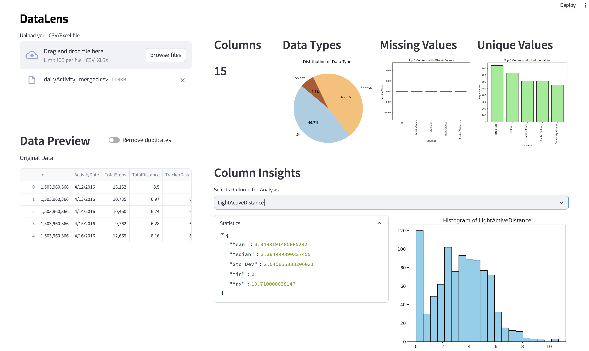

# DataLens
DataLens is a powerful and user-friendly data exploration tool designed to help users quickly analyze and visualize their datasets. It supports file upload in CSV and Excel formats and provides insights such as data types, missing values, unique values, time series analysis, and text analysis (e.g., most frequent words).



## Tech Stack

        


## Features

- **Data Upload**: Upload CSV or Excel files to analyze.
- **Data Preview**: Preview data before and after cleaning.
- **Data Cleaning**: Option to remove duplicates from the dataset.
- **Data Summary**: Provides a summary of the dataset including data types, missing values, and unique values.
- **Text Analysis**: Generate insights like the most frequent words in textual data columns.
- **Data Visualizations**:
  - Histogram for numerical data.
  - Bar charts for categorical data.
  - Time series plots for datetime columns.
  - Pie charts showing distribution of data types.
  - Insights on missing and unique values.

## Installation

To install and set up the DataLens project, follow these steps:

1. **Clone the repository**:
    ```bash
    git clone https://github.com/coding-chemist/DataLens.git
    cd datalens
    ```

2. **Set up a virtual environment** (using `conda` or `venv`):
    ```bash
    conda create --name datalens-env python=3.8
    conda activate datalens-env
    ```

3. **Install dependencies**:
    ```bash
    pip install -r requirements.txt
    ```

4. **Ensure the following dependencies are included in `requirements.txt`**:
    ```txt
    pandas
    streamlit
    matplotlib
    plotly
    numpy
    openpyxl
    ```

## Prerequisites

Before running DataLens, make sure you have the following prerequisites:

- Python 3.12 or higher
- Conda (or virtual environment)
- Required libraries (`pandas`, `streamlit`, `matplotlib`, `plotly`, `numpy`, `openpyxl`)

To set up the environment using Conda and install dependencies from the `requirements.txt` file, use the following command:

```bash
conda create --name datalens-env python=3.12
conda activate datalens-env
pip install -r requirements.txt
```
## Run the App
Start the app by running the following command:

```bash
streamlit run app/app.py
```
The app will launch in your browser at http://localhost:8501.

## Usage
- **Upload your dataset:** Click the "Upload your CSV/Excel file" button to upload your dataset.
- **Data Cleaning:** Toggle the option to remove duplicates if needed.
- **Visualizations:** After selecting a column for analysis, DataLens will generate visualizations (e.g., bar charts, histograms, time series, etc.).
- **Text Analysis:** For text-based columns, DataLens will analyze the most frequent words and display them.

## Project Structure
The project is organized as follows:

```tree
datalens/
├── app/
│   ├── app.py                 # Main Streamlit app file
│   ├── utils.py               # Utility for displaying HTML content
│   └── app.html               # HTML content for the app's interface
├── requirements.txt           # List of project dependencies
├── LICENSE                    # MIT License
├── .gitignore                 # Specifies files and directories to be ignored by Git
├── src/
│   ├── data_processing.py     # Functions for loading, cleaning, and summarizing data
│   ├── data_insights.py       # Functions to generate statistics and insights from data
│   ├── text_analysis.py       # Functions for text analysis (e.g., most common words)
│   └── visualization.py       # Functions for generating charts and visualizations
└── README.md                  # Project documentation (this file)
```


## Contributing
Welcome your contributions to DataLens! If you would like to contribute, please fork the repository, create a new branch, and submit a pull request with your changes.

## License
DataLens is open-source software licensed under the MIT License. See the [LICENSE](LICENSE) file for more information.

## Acknowledgments
**Logo:** The logo image used in this project was sourced from [Weasyl](https://cdn.weasyl.com/~ley/submissions/524374/ca8423f69f9347a4943e373d5a2bf3cdede228ea8347e1fefcef0ef700934df2/ley-camera-lens-illustrator.png).

**Libraries Used:**
- Streamlit for the app interface.
- Pandas for data manipulation.
- Matplotlib and Plotly for visualizations.